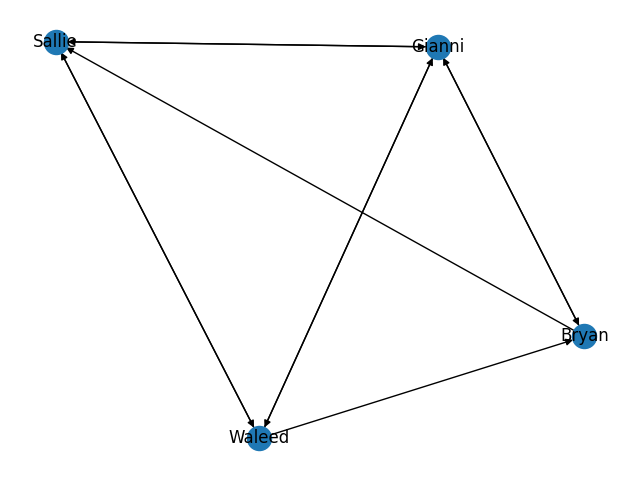
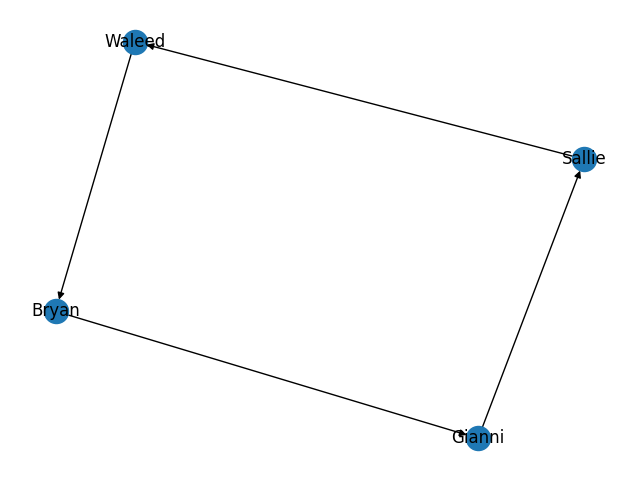
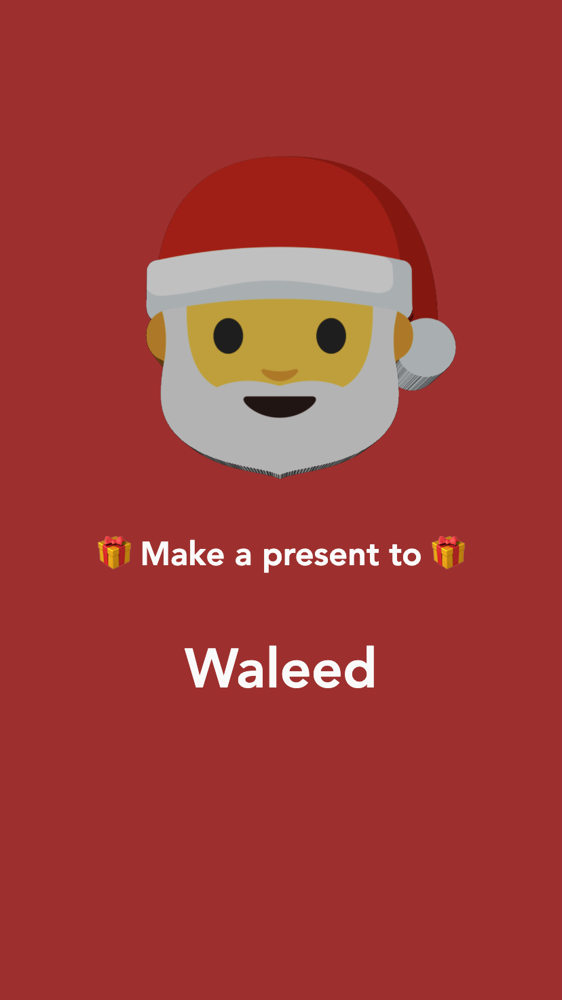

<p align="center">
  
</p>
<h1 align="center">Simple Secret Santa<br />(with constraints)</h2>

A backendless application for organizing a Secret Santa 🎁 with your friends,
removing the stress of drawing names and enabling constraints to avoid
unfortunate combinations.

- [Motivation](#motivation)
- [Preparation](#preparation)
- [Generate pairs](#generate-pairs)
- [Build](#build)
- [Deploy](#deploy)
- [Demo](#demo)
- [F.A.Q.](#faq)

## Motivation

***A:*** *Let's do Secret Santa this year! 🎅🎉🎉*

***Everyone:*** *Oh gosh, why? 😩*

***A:*** *Come on, it's gonna be fun! 🤩🤗*

***B:*** *Aight, let's do this... 🤦*

***C:*** *Fine, but please don't put me with X 🙏*

***D:*** *Yeah, and please I don't want presents from Y, last year it was
terrible! 😬*

Does this conversation pattern fit your group of friends too? Then let this
Simple Secret Santa (with constraints) help your case.

## Preparation

First thing first, edit [`default.conf`](./default.conf) to fit your needs. The
configuration file structure is quite straightforward and self explanatory:

```ini
[Participants]
# ...

[Constraints]
# ...
```

The `[Participants]` section should contain the names of the people involved in
the secret santa drawing. One name per line (without commas).

```ini
[Participants]

Sallie
Gianni
Bryan
Waleed
```

The `[Constraints]` sections is where you can play god without being acquainted
with the devil.

Suppose _Bryan_ must not draw _Waleed_. Just write:

```ini
Bryan /-> Waleed
```

Suppose now you want Sallie to draw one of Gianni or Waleed. Just write:

```ini
Sallie --> Gianni, Waleed
```

## Generate pairs

After you are done gathering all the information about who hates/loves who, you
can execute [`draw.py`](./draw.py). It will parse the configuration file into a
directed graph and then reduce it so that every node (participant) makes and
receives one and only one present.

For example, the following configuration file

```ini
[Participants]
Sallie
Gianni
Bryan
Waleed

[Constraints]
Bryan  /-> Waleed
Sallie --> Gianni, Waleed
```

is parsed into the following graph (left), which is then reduced to the final
result (right), where it's clear who makes presents to who.

<p align="center">
  
  
</p>

Just excute the following command and you'll end up with a sweet `pairs.json`
file inside folder `public`.

```shell
npm run draw
```

**Note:** To safeguard you from erroneusly looking at the drawing result, names
are base-64 encoded. However, it would be great if you could show the
combinations to someone who can double-check. I'm not responsible for people
not receiving presents because of bugs in this code.

## Build

```shell
npm install
npm run build
```

## Deploy

There's no backend. You can upload the content of `dist` folder to literally
any service that support hosting static sites.

For example, here you can learn about
[Hosting a static website on Amazon S3](https://docs.aws.amazon.com/AmazonS3/latest/dev/WebsiteHosting.html).
Or if you feel hackish, you can serve them locally and expose them to the
public internet with [ngrok](https://ngrok.com/).

P.S.: There's also a Dockerfile...

```shell
docker build -t simple-secret-santa .
docker run --rm -it -p80:80 simple-secret-santa
```

To extract the codes you can do:

```shell
docker run --rm -it simple-secret-santa cat codes.json
```

## Demo

<p align="center">
  
  
  
  
</p>

<p align="center">
  
</p>

## F.A.Q

### My configuration is correct but `npm run draw` doesn't work

You have probably been blinded by the immense power of playing with
constraints and your requirements are unsatisfiable.

Consider removing some constraints... After all, why shouldn't Bryan make a
present to Waleed?

Nevertheless, if you can show me a solution you found by hand that `npm run draw`
was not able to generate, you might have found a bug. Feel free to open an
[Issue](https://github.com/mcieno/simple-secret-santa/issues).

### I have a trillion friends and a quintillion constraints. When I execute `npm run draw` it crashes my PC

The algorithm implemented in `draw.py` uses recursion and backtracking; i.e.,
sucks. It's not efficient, not optimized, and I'm not planning to improve it.

### Why is this written in Vue in the first place? It's litterally a single page with a form

I've been asking myself the same question...
