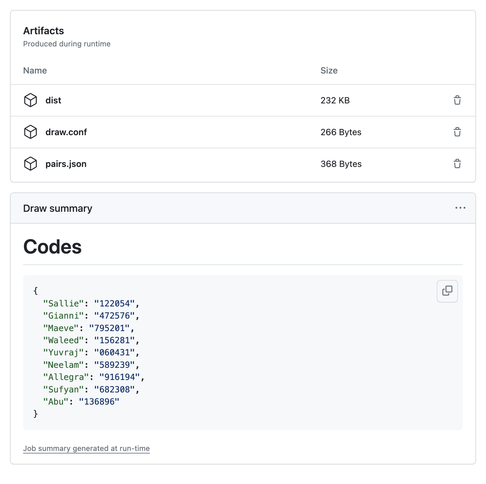

<p align="center">
  
</p>
<h1 align="center">Simple Secret Santa<br />(with constraints)</h2>

A backendless application for organizing a Secret Santa 🎁 with your friends,
removing the stress of drawing names and enabling constraints to avoid
unfortunate combinations.

- [Motivation](#motivation)
- [Deploy](#deploy)
- [Demo](#demo)
- [F.A.Q.](#faq)

## Motivation

***A:*** *Let's do Secret Santa this year! 🎅🎉🎉*

***Everyone:*** *Oh gosh, why? 😩*

***A:*** *Come on, it's gonna be fun! 🤩🤗*

***B:*** *Aight, let's do this... 🤦*

***C:*** *Fine, but please don't put me with X 🙏*

***D:*** *Yeah, and please I don't want presents from Y, last year it was
terrible! 😬*

Does this conversation pattern fit your group of friends too? Then let this
Simple Secret Santa (with constraints) help your case.

## Deploy

To deploy your own instance of Simple Secret Santa (with constraints) you will
have to:

1. write your own configuration file with participants and constraints
2. run the drawing script
3. build the frontend with the resulting pairs
4. upload the frontend bundle on your favorite hosting platform

For convenience, all this process is automated via GitHub Actions.
You'll simply have to take the resulting bundle and throw it into your favorite
static site hosting platform
([Cloudflare Pages](https://developers.cloudflare.com/pages/get-started/direct-upload),
[AWS Amplify](https://docs.aws.amazon.com/amplify/latest/userguide/manual-deploys.html),
what have you).

### Step 1: fork the repo

First things first, in order to be able to freely configure and run the GitHub
Actions workflow you'll need to fork this repo.

I also suggest you make it private, otherwise everyone will be able to read your
configuration and tell which of your friends love/hate each other.

### Step 2: write your own configuration

The configuration needs to be written in a GitHub Actions variable named
`CONFIG`.

Navigate to the repository settings and select
<kbd>
  <kbd><samp>Secrets and variables</samp></kbd>
  ⇒
  <kbd><samp>Actions</samp></kbd>
  ⇒
  <kbd><samp>Variables</samp></kbd>
</kbd>.

<p align="center">
  
</p>

Then click on <kbd><kbd><samp>New repository variable</samp></kbd></kbd>
and create the `CONFIG` variable with your own configuration:

<p align="center">
  
</p>

#### How to write a configuration

The configuration file structure is quite straightforward and self explanatory:

```ini
[Participants]
# ...

[Constraints]
# ...
```

The `[Participants]` section should contain the names of the people involved in
the secret santa drawing. One name per line (without commas).

```ini
[Participants]
Sallie
Gianni
Bryan
Waleed
```

The `[Constraints]` sections is where you can play god without being acquainted
with the devil.

Suppose _Bryan_ must not draw _Waleed_. Just write:

```ini
Bryan /-> Waleed
```

Suppose now you want Sallie to draw one of Gianni or Waleed. Just write:

```ini
Sallie --> Gianni, Waleed
```

### Step 3: draw and build

It's now finally time to let the CI do the drawing and build your site.

Navigate to the <kbd><kbd><samp>Actions</samp></kbd></kbd> tab of the
repository, select the <kbd><kbd><samp>Build</samp></kbd></kbd> workflow and
run it.

<p align="center">
  
</p>

**Note:** here you'll also have the chance to customize parts of the final site
like language and texts. Simply fill the fields that you'd like to override.

### Step 4: upload the frontend bundle

As soon as the workflow completes, you'll find a bunch of artifacts available
for download.

<p align="center">
  
</p>

Grab <kbd><kbd><samp>dist</samp></kbd></kbd> and drop it on your favorite
hosting platform.

🎉 Congratulations! You saved your friends from an unpleasant Secret Santa!
Just share them their code and let's see how many of you will receive ugly socks
this year 🧦.

**Note:** for the sake of debugging, artifact
<kbd><kbd><samp>pairs.json</samp></kbd></kbd> contains the drawing result.
To safeguard you from erroneusly looking at pairs, names are base-64 encoded.
However, it would be great if you could hand over the combinations to someone
for double-checking. I'm not responsible for people not receiving presents
because of bugs in the drawing process.

## Demo

Check out the [live demo](https://simple-secret-santa.pages.dev/).

Here are some screenshots btw.

<p align="center">
  
  
  
  
</p>

<p align="center">
  
</p>

## F.A.Q

Answers to questions you've never asked.

### How does the magical drawing algorithm work?

The configuration is parsed into a directed graph which is then reduced until
every node (participant) makes and receives one and only one present.

For example, the following configuration file

```ini
[Participants]
Sallie
Gianni
Bryan
Waleed

[Constraints]
Bryan  /-> Waleed
Sallie --> Gianni, Waleed
```

is parsed into the following graph (left), which is then reduced to the final
result (right), where it's clear who makes presents to who.

<p align="center">
  
  
</p>

### I have a trillion friends and a quintillion constraints. The drawing script crashes my PC.

The drawing algorithm uses recursion and backtracking; i.e., sucks.
It's not efficient, not optimized, and I'm not planning to improve it.

### My configuration is correct but the drawing script doesn't work.

You've probably been blinded by the immense power of playing with constraints
and your requirements are unsatisfiable.

Consider removing some constraints... After all, why shouldn't Bryan make a
present to Waleed?

Nevertheless, if you can show me a solution you found by hand that the drawing
algorithm was not able to generate, you might have found a bug.
Congratz! Feel free to open an
[Issue](https://github.com/mcieno/simple-secret-santa/issues).

### I'm a bare-hands-old-school-self-hosting aficionado. Screw your pipelines! I want to manually do the drawing, building and hosting.

There's a Dockerfile tailored to you!

```shell
# Write your configuration.
touch my.conf

# Build the image.
#
# You can customize language/texts by passing build arguments.
# Have a look at the Dockerfile to figure out all the configurable arguments.
#
# For example, to build the italian version use
#   --build-arg I18N_LANGUAGE=it
# Or to tell everyone that the budget is 20€ use
#   --build-arg I18N_OVERRIDE_SANTA_EXTRA="The budget is 20€"
#
docker build -t simple-secret-santa --build-arg CONFIG=my.conf .

# Print the codes. You'll have to share these with the participants somehow.
docker run --rm -it simple-secret-santa cat /codes.json

# Host the site.
docker run --rm -it -p80:80 simple-secret-santa
```

### Why is this written in ~~Vue~~ Astro + SolidJS in the first place? It's litterally a single page with a form...

I've been asking myself the same question...
